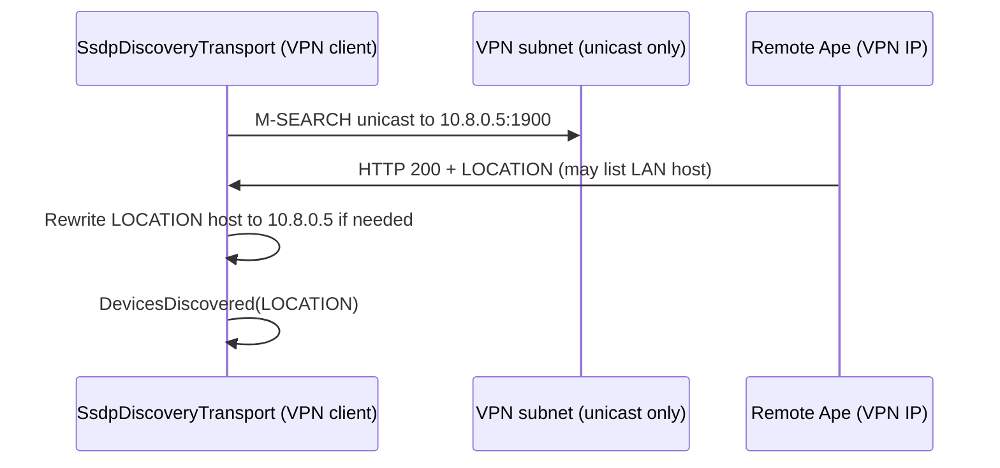

# SSDP Device Discovery — Multicast, VPN Unicast, and LOCATION Handling

## Status

Current implementation (`Ape.Module.DiscoveryManager`)

## Date

2026-05-29

---

## 1. Purpose

This document describes how **device discovery** works in the Discovery Manager module, with emphasis on **SSDP** (Simple Service Discovery Protocol): standard **M-SEARCH multicast** on the LAN, and the extra behavior needed so discovery still works over **VPN tunnels** where multicast is typically not forwarded.

The public surface is `DiscoveryManagerService`, which registers one or more `IDiscoveryTransport` implementations. SSDP discovery is implemented by `SsdpDiscoveryTransport`; SSDP advertisement (NOTIFY) uses `SsdpAdvertisementTransport` (Rssdp). Optional **mDNS** browse is a separate transport and is not VPN-specific.

---

## 2. Problem: why LAN SSDP is not enough on VPN

SSDP discovery normally works like this:

1. A client sends **M-SEARCH** to the link-local multicast group **`239.255.255.250:1900`**.
2. Devices listening on UDP 1900 respond (often via **unicast**) with an HTTP-style message containing a **`LOCATION:`** URL.
3. Devices may also send periodic **`NOTIFY`** multicasts when they come online.

On a typical **site-to-site or remote-access VPN**:

- Multicast traffic is usually **not routed** across the tunnel.
- Peers only see each other via **unicast** addresses on the VPN subnet (e.g. `10.8.0.x`).
- A device may still put its **LAN** address in `LOCATION` (e.g. `http://192.168.1.50:5000/...`), which is **unreachable** from the VPN client even if the SSDP reply arrived over the tunnel.

The module addresses both issues: **reach peers without multicast**, and **make `LOCATION` usable from the VPN path**.

---

## 3. Architecture overview

```text
DiscoveryManagerService
    │
    ├─ SsdpDiscoveryTransport     ← listen :1900, M-SEARCH out/in, parse NOTIFY/responses
    ├─ SsdpAdvertisementTransport ← Rssdp NOTIFY (separate concern)
    └─ MdnsDiscoveryTransport     ← optional Zeroconf browse (LAN-oriented)
```

`SsdpDiscoveryTransport` uses a **single UDP socket** bound to **`0.0.0.0:1900`** with `SO_REUSEADDR`. That socket:

- Joins SSDP multicast on every eligible IPv4 interface.
- Sends periodic and on-demand **M-SEARCH** (multicast per interface, plus VPN unicast fallback).
- Receives **NOTIFY**, **M-SEARCH responses**, and optionally answers **inbound M-SEARCH** on the same port.

Using one socket for discovery **and** inbound M-SEARCH replies avoids a second process binding port 1900 and stealing unicast responses.

---

## 4. Standard multicast path (LAN)

### 4.1 Eligible interfaces

`SsdpInterfaceHelper.GetEligibleLocalIpv4UnicastAddresses()` collects IPv4 addresses from interfaces that are:

- **Up**
- Not **loopback**
- Have a non-loopback **IPv4** unicast address

### 4.2 Multicast membership

On start, the transport:

1. Creates a UDP socket and binds to port **1900**.
2. For each eligible local address, calls `AddMembership` for group **`239.255.255.250`** scoped to that interface.
3. If no interface qualifies, falls back to a default `MulticastOption` without a specific local address.

### 4.3 M-SEARCH egress per interface

`SendMsearchAllInterfaces` sets `MulticastInterface` to each joined local address, then sends the same M-SEARCH payload to `239.255.255.250:1900`:

```http
M-SEARCH * HTTP/1.1
HOST: 239.255.255.250:1900
MAN: "ssdp:discover"
MX: 2
ST: upnp:rootdevice
```

This ensures M-SEARCH leaves on **Wi‑Fi, Ethernet, VPN NIC**, etc., not only the OS default route.

### 4.4 Timing

- **On start**: one multicast M-SEARCH round + VPN unicast probe (if enabled).
- **Every 8 seconds**: same via `PeriodicMsearchAsync`.
- **Active search** (`DiscoverDevicesAsync`): sends both, waits **3.5 s**, returns collected `LOCATION` values.

Passive discovery also handles **`NOTIFY ssdp:alive`** and **`ssdp:byebye`** on the receive loop.

---

## 5. VPN unicast M-SEARCH fallback

When `ssdp.vpnUnicastProbe.enabled` is **true** (default), `SendVpnUnicastMsearch` runs after each multicast M-SEARCH round.

### 5.1 What it does

Instead of (or in addition to) multicast, the client sends the **same M-SEARCH payload** via **unicast UDP** to:

```text
<each candidate host IP> : 1900
```

Many SSDP stacks listen on port **1900** and accept unicast M-SEARCH on that port even when multicast never crosses the VPN.

### 5.2 Which subnets and hosts are probed

**Probe subnets** are built by `CollectProbeSubnets()`:

| Configuration | Behavior |
|---------------|----------|
| `probeSubnets` **non-empty** | Only those CIDR strings (e.g. `"10.8.0.0/24"`) are used for host enumeration. |
| `probeSubnets` **empty** | Subnets are **inferred** from local VPN interfaces via `GetLocalVpnSubnets()`. |

**VPN interface detection** (`LooksLikeVpnInterface`):

- `NetworkInterfaceType` is **Tunnel** or **Ppp**, **or**
- Interface name starts with **`utun`**, **`wg`**, **`tun`**, **`tap`**, or **`ppp`** (case-insensitive).

For each qualifying interface, IPv4 unicast addresses with prefix length **1–30** become `/prefix` subnets.

**Host enumeration** (`SsdpSubnetHelper.EnumerateHostAddresses`):

- Walks host addresses in the subnet (skips network/broadcast-style edges; no scan if prefix **> /30**).
- Skips the machine’s **own** IPv4 addresses (so we do not M-SEARCH ourselves).
- Stops after **`maxHostsPerSubnet`** hosts (default **254**, clamped 1–4096).

**Extra hosts**: `extraProbeHosts` is always merged in (useful for **`/32`** VPN addresses where subnet scan yields nothing).

### 5.3 Example

VPN client `10.8.0.2/24` on `wg0`:

- Inferred subnet `10.8.0.0/24`.
- Unicast M-SEARCH sent to `10.8.0.1`, `10.8.0.3`, … up to the host limit (excluding `10.8.0.2`).
- A peer at `10.8.0.5` receiving unicast M-SEARCH can reply unicast to the client’s `:1900` socket.

---

## 6. Inbound M-SEARCH responder (same socket)

`DiscoveryManagerService` passes `SsdpDiscoveryMsearchResponderOptions` into `SsdpDiscoveryTransport` with the local device **USN** and **LOCATION** URL.

When a datagram starts with **`M-SEARCH`** and `ST:` matches **`ssdp:all`** or **`urn:ape:device:core:1`**, the transport replies with **HTTP/1.1 200 OK** including `LOCATION`, `USN`, and `ST`, sent **unicast** back to `remoteEndPoint`.

That allows remote VPN peers running the same discovery logic to find **this** instance via unicast M-SEARCH, not only via multicast NOTIFY.

---

## 7. LOCATION rewrite for VPN responses

Even when discovery succeeds, `LOCATION` may point at a **LAN IP** while the UDP reply came from a **VPN IP**.

`SsdpLocationHelper.RewriteHostFromResponseSource` runs when:

- `rewriteLocationHost` is **true** (default), and
- The UDP source address lies in one of the configured or inferred **VPN subnets**, and
- The `LOCATION` URI host differs from that source address.

Then the **host** in `LOCATION` is replaced with the **response source IP**, preserving scheme, port, and path. Example:

```text
LOCATION: http://192.168.1.50:5000/api/discovery/device.xml
Response from: 10.8.0.5
→ http://10.8.0.5:5000/api/discovery/device.xml
```

`_vpnRewriteSubnets` is refreshed from inferred VPN subnets plus any explicit `probeSubnets` CIDRs.

---

## 8. Parsing, deduplication, and self-filtering

`SsdpDatagramParser` extracts headers and decides whether to report a device:

- **NOTIFY** with `NTS: ssdp:alive` → report `LOCATION`
- **NOTIFY** with `NTS: ssdp:byebye` → `DeviceLost`
- First line contains **`200 OK`** → treat as M-SEARCH response

`HandleDeviceAvailable` ignores:

- Same device **UUID** as local (`USN` contains local UUID)
- Same **IP** as preferred local IP in `LOCATION`
- **localhost** / **127.0.0.1** URLs

Duplicate `LOCATION` strings are suppressed after the first discovery event.

---

## 9. Configuration

Module section: `modules["Ape.Module.DiscoveryManager"]`.

Sample: `Samples/discovery-test.json`. mDNS browse is **off** unless `mdns.browseServices` lists PTR names (the sample uses `_http._tcp`). Product-specific names belong in that host JSON, not in module defaults.

```json
"mdns": {
  "browseServices": ["_http._tcp"],
  "scanSeconds": 4,
  "pollSeconds": 12
},
"ssdp": {
  "vpnUnicastProbe": {
    "enabled": true,
    "rewriteLocationHost": true,
    "probeSubnets": [],
    "extraProbeHosts": [],
    "maxHostsPerSubnet": 254
  }
}
```

| Key | Default | Meaning |
|-----|---------|---------|
| `enabled` | `true` | Run VPN unicast M-SEARCH after each multicast round |
| `rewriteLocationHost` | `true` | Rewrite `LOCATION` host from VPN UDP source when needed |
| `probeSubnets` | `[]` | Explicit CIDRs to scan; empty ⇒ infer from VPN NICs |
| `extraProbeHosts` | `[]` | Additional IPv4 addresses to probe (e.g. known peer on `/32`) |
| `maxHostsPerSubnet` | `254` | Cap on unicast probes per subnet |

Options are parsed by `SsdpDiscoveryOptions.Parse` from the module config node.

---

## 10. End-to-end flow (VPN client discovering a remote peer)



Multicast path on LAN is unchanged: M-SEARCH to `239.255.255.250`, NOTIFY, and per-interface membership.

---

## 11. Limitations and operational notes

- **IPv4 only** for SSDP VPN logic (multicast join, subnet math, probes).
- **Subnet scanning** can generate many packets on large VPN subnets; use `probeSubnets` + `maxHostsPerSubnet` to limit scope, or `extraProbeHosts` for a small known set.
- **/31 and /32** interfaces do not yield enumerable host ranges; use **`extraProbeHosts`** for point-to-point links.
- Unicast M-SEARCH does not guarantee a reply; firewalls must allow **UDP 1900** bidirectionally on the VPN.
- **mDNS** discovery does not implement the same VPN unicast fallback; SSDP is the supported cross-VPN mechanism in this module.
- Advertisement (`SsdpAdvertisementTransport`) still uses Rssdp’s default behavior; discovery-side VPN workarounds are in `SsdpDiscoveryTransport`.

---

## 12. Source map

| Area | Type |
|------|------|
| `Services/DiscoveryManagerService.cs` | Wires transports, M-SEARCH responder, initial active search |
| `Transport/Ssdp/SsdpDiscoveryTransport.cs` | Socket, multicast, VPN unicast M-SEARCH, receive loop |
| `Transport/Ssdp/SsdpInterfaceHelper.cs` | Eligible LAN + VPN interface detection |
| `Transport/Ssdp/SsdpSubnetHelper.cs` | CIDR parse, host enumeration |
| `Transport/Ssdp/SsdpLocationHelper.cs` | LOCATION host rewrite |
| `Transport/Ssdp/SsdpDiscoveryOptions.cs` | Config parsing |
| `Transport/Ssdp/SsdpDatagramParser.cs` | M-SEARCH payload and message parsing |
| `Transport/Ssdp/SsdpAdvertisementTransport.cs` | NOTIFY / publish (not VPN-specific) |
